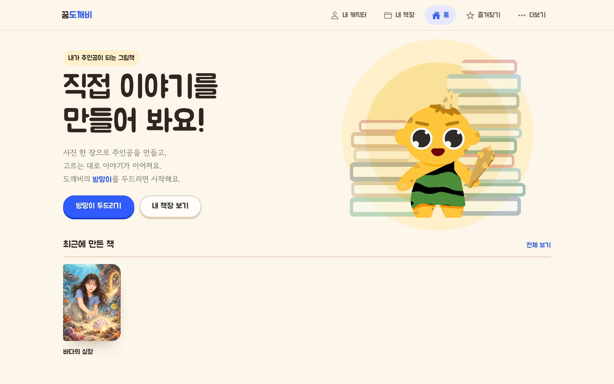
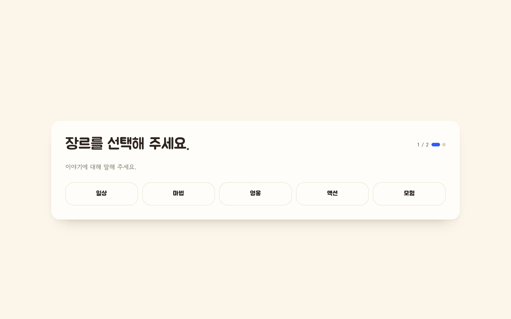
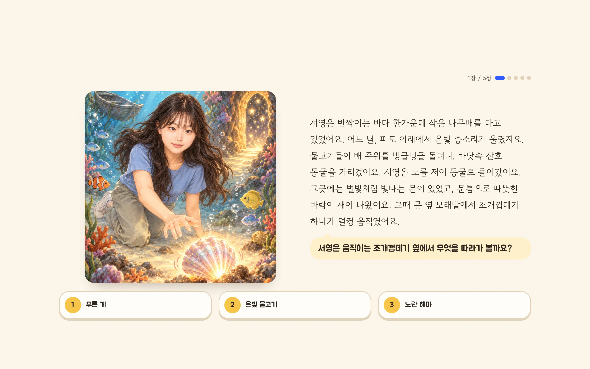
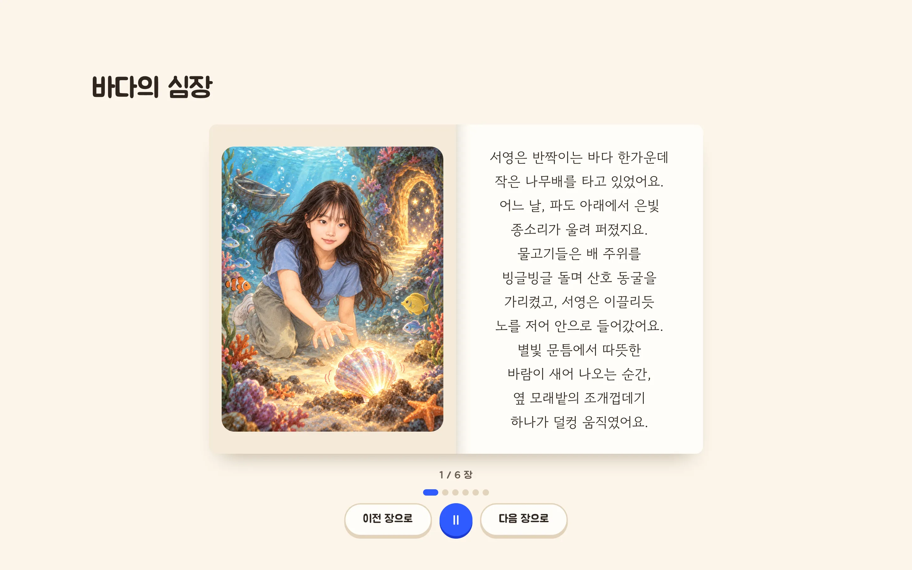
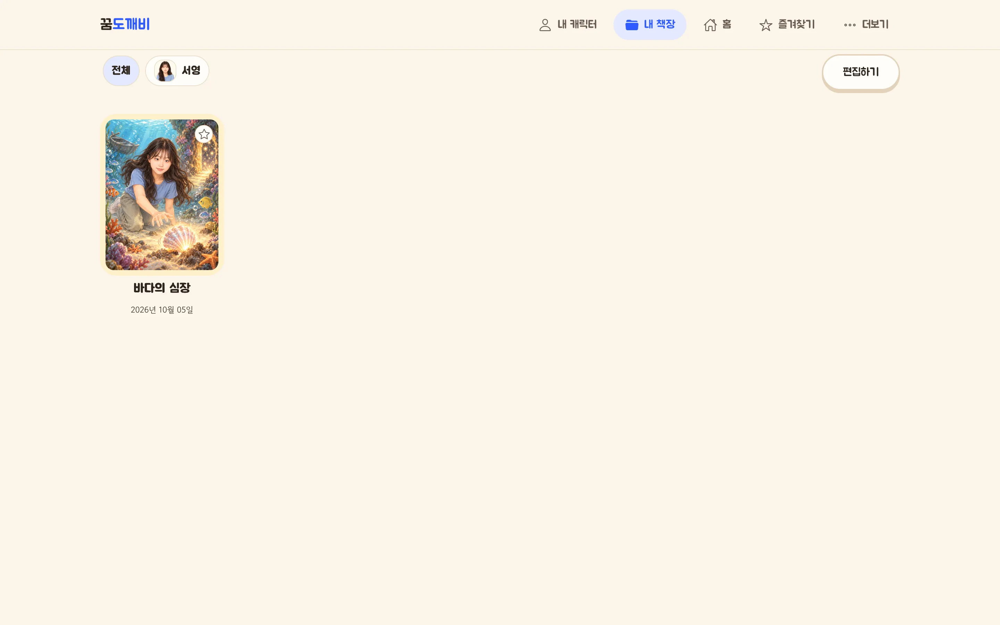

# 꿈도깨비

아이 사진과 선택을 반영해 아이가 주인공인 그림책을 만드는 웹 서비스. 7~9세 아이와 보호자용

- **문서 대상**: 저장소를 처음 실행하는 개발자. 로컬 실행과 구조 파악용
- **확인 기준**: 2026-10-06 KST. macOS(Apple Silicon)에서 아래 명령을 직접 실행해 확인

## 1. 주요 기능

- **사진으로 만드는 주인공**: 사진 1장 → 기준 캐릭터 후보 생성. 보호자가 승인하거나 "다시 만들기"
- **선택형 이야기**: 장르·장소 선택 후 장면마다 선택지 3개 중 하나 선택 → 다음 장면의 글·삽화 생성
- **선택지 미리 생성**: 장면 표시 직후 선택지별 다음 장면을 미리 생성 → 고른 뒤 대기 시간 단축
- **읽기·책장**: 완성 동화를 읽기 화면에서 낭독(브라우저 음성 합성). 책장에 보관
- **실행 모드 3종**: 실제(codex로 생성)·대역(가짜 글·그림, 외부 호출 없음)·재생(저장본 사용)
- **비교 실험 도구**: 생성 방식 4종 일괄 실행·블라인드 검토 화면·리포트

## 2. 요구 사항

| 항목 | 버전·조건 | 용도 |
| --- | --- | --- |
| macOS + Homebrew | Apple Silicon에서 확인 | 스크립트가 `brew`·`lsof`·`sips` 사용 |
| MySQL | Homebrew `mysql` | 사용자·캐릭터·장면·동화 저장 |
| JDK | Homebrew `openjdk@21` | Spring Boot 3.4 |
| uv | Python 3.12 이상 | FastAPI. 의존성은 `uv run`이 자동 설치 |
| Bun | 1.4 이상 | 프론트 의존성 설치·실행 |
| Node.js | 24 이상 | `react-scripts` 실행 |
| codex CLI | ChatGPT 계정 로그인·이미지 생성 기능 켜짐 | 실제 모드만 필요. 대역 모드는 불필요 |

## 3. 설치·실행

### 최초 1회

```bash
brew install mysql openjdk@21 uv node oven-sh/bun/bun
brew services start mysql
bash scripts/setup-db.sh
(cd frontend && bun install)
```

- **setup-db.sh**: DB 3개(본 서비스·대역·테스트)와 전용 사용자 생성. 접속 정보는 `.local/db.env`에 자동 생성
- **Spring 설정**: `application.properties`가 없으면 첫 `dev-up.sh` 실행 때 자동 생성

### 실행·종료

```bash
bash scripts/dev-up.sh --fake   # 대역 모드: 외부 호출 없음
bash scripts/dev-down.sh        # 종료
```

- **접속 주소**: http://localhost:3100
- **실행 결과**: 세 서버(FastAPI 8000·Spring 8080·React 3100)가 200을 응답할 때까지 최대 180초 대기. 완료 시 `mode=fake`와 주소 3개 출력
- **소요 시간**: 다시 띄울 때 약 4초(빌드 캐시 있는 상태). 첫 실행은 Gradle·의존성 준비로 더 걸림
- **실제 모드**: `bash scripts/check-env.sh`로 로그인·한도 확인 후 `bash scripts/dev-up.sh`. 업로드 사진이 OpenAI로 전송됨(9장 참고)
- **모드 전환**: `dev-down.sh` 후 다시 `dev-up.sh`. 다른 모드가 떠 있으면 `dev-up.sh`가 exit 1로 거부
- **종료 범위**: 이 프로젝트의 프로세스만 종료. 같은 포트의 다른 프로세스는 유지

## 4. 설정

- **지정 방법**: 실행 전 환경 변수 또는 `backend-fastAPI/.env`. 환경 변수가 우선
- **자동 지정**: `DATA_DIR`·`GEN_FAKE`·`CODEX_BIN`·`SPRING_DATASOURCE_URL`은 `dev-up.sh`가 모드별로 지정

### FastAPI

| 이름 | 용도 | 필수 |
| --- | --- | --- |
| `GEN_METHOD` | 생성 방식. `gpt_char`·`gpt_char_photo`·`gpt_photo`·`baseline_repaired` | 선택 |
| `DEMO_REPLAY` | 저장본 재생. `0`(끔)·`prefer`(저장본 우선)·`1`(저장본만) | 선택 |
| `DEMO_CAP_POINTS` | 서버 기동 후 한도 사용률 증가 상한(%p). 넘으면 생성 중단 | 선택 |
| `LAB_CAP_POINTS` | 비교 실험 누적 한도 사용 상한(%p) | 선택 |
| `GEN_CONCURRENCY` | 종류(글·그림)별 동시 codex 실행 수 | 선택 |
| `GEN_PREFETCH` | 선택지별 다음 장면 미리 생성 여부 | 선택 |
| `TEXT_TIMEOUT_S`·`IMAGE_TIMEOUT_S` | 글·그림 생성 제한 시간(초) | 선택 |
| `GEN_FAKE` | 대역 모드 여부 | 선택 |
| `GEN_FAKE_ERROR`·`GEN_FAKE_DELAY_MS` | 대역 모드의 실패·지연 흉내 | 선택 |
| `DATA_DIR` | 사진·그림·실험 기록 저장 폴더 | 선택 |
| `FILE_BASE_URL` | 응답에 넣는 그림 주소의 앞부분 | 선택 |
| `CODEX_BIN`·`CODEX_HOME_DIR` | codex 실행 파일·기록 폴더 위치 | 선택 |
| `CODEX_MODEL`·`CODEX_IGNORE_USER_CONFIG`·`CODEX_USE_OUTPUT_SCHEMA` | codex 호출 옵션 | 선택 |
| `COMFY_URL` | 기준선(ComfyUI) 주소 | 선택 |
| `ENV_FILE` | 읽을 env 파일 경로. 빈 값이면 파일 미사용 | 선택 |

### Spring·프론트·배포

| 이름 | 용도 | 필수 |
| --- | --- | --- |
| `DB_USER`·`DB_PASSWORD`·`DB_NAME`·`DB_TEST_NAME`·`DB_QA_NAME` | MySQL 접속 정보(`.local/db.env`). `setup-db.sh`가 생성 | 필수(자동 생성) |
| `SPRING_DATASOURCE_URL` | Spring DB 주소 덮어쓰기 | 선택 |
| `REACT_APP_API_BASE_URL`·`REACT_APP_FILE_BASE_URL` | Spring·FastAPI 주소(`frontend/.env.development`) | 필수 |
| `HOST`·`PORT` | React 개발 서버 주소(`frontend/.env.development`) | 필수 |
| `deploy/.env`의 변수 | EC2 데모 배포용. 목록은 [docs/DEPLOY-ec2.md](docs/DEPLOY-ec2.md) 참고 | 배포 시 필수 |

## 5. 사용법

### 화면 흐름

- **촬영 조건**: 2026-10-06 KST 한 세션에서 촬영. 폭 1440px(2배 해상도)
- **촬영 데이터**: 홈·읽기·책장은 실제 생성 동화, 만들기 흐름은 같은 동화의 저장본 재생(`DEMO_REPLAY=1`). 업로드 원본 사진은 흐림 처리

1. **홈**: 제목과 "최근에 만든 책" 표시. "방망이 두드리기"로 새 그림책 시작
2. **주인공 만들기**: 사진 업로드 → 이름 입력 → 후보 확인 → "이 캐릭터로 할래요" 또는 "다시 만들기"
3. **이야기 고르기**: 장르(일상·마법·영웅·액션·모험)·장소(우주·왕국·산·바다·학교·집) 선택
4. **이야기 진행**: 장면마다 선택지 3개 중 선택. 마지막 장면 뒤 읽기 화면으로 이동
5. **읽기**: "이전 장으로"·"다음 장으로"로 넘기기. 가운데 버튼으로 낭독 재생·정지
6. **책장**: 완성 동화 목록. 캐릭터별 보기·"편집하기"



그림 1. 홈. 아래 줄에 최근 완성 동화 표시 → 누르면 읽기 화면


그림 2. 캐릭터 확인. 왼쪽 원본 사진(흐림 처리)과 오른쪽 "동화 속 모습"을 비교해 승인



그림 3. 장르 선택. 다음 단계에서 같은 형식으로 장소 선택



그림 4. 이야기 진행. 장면 글·삽화·질문 아래 선택지 3개. 오른쪽 위 점으로 진행 단계 표시



그림 5. 읽기. 펼친 책 형태로 장마다 삽화와 글 표시



그림 6. 책장. 위쪽 칩으로 캐릭터별 동화만 보기

### 명령·주소

| 명령·주소 | 용도 |
| --- | --- |
| `bash scripts/check-env.sh` | codex 로그인·이미지 기능·한도 사용률(`used_percent`)·초기화 시각(`resets_at`) 확인 |
| http://localhost:8000/health | 떠 있는 모드·생성 방식·재생 설정 확인 |
| http://localhost:8000/lab/review | 비교 실험 블라인드 검토 화면(실제 모드) |
| `uv run python -m app.lab ...` | 비교 실험 실행. 순서·이어 하기는 [docs/RUN.md](docs/RUN.md) 참고 |

## 6. 테스트·검증

| 대상 | 명령 | 소요 시간 |
| --- | --- | --- |
| FastAPI | `cd backend-fastAPI && uv run pytest -q` | 약 14초 |
| Spring | `bash scripts/spring-test.sh` | 약 5초(컴파일 캐시 있는 상태) |
| React | `cd frontend && bun run build` | 약 12초 |
| API 전체 흐름(e2e) | `bash scripts/qa-api-flow.sh` | 약 8초 |

- **측정 조건**: 2026-10-06 KST, Apple M5 Pro
- **Spring**: `./gradlew test` 직접 실행은 `JAVA_HOME` 미지정으로 실패 → `spring-test.sh` 사용
- **React**: 단위 테스트·타입 검사 없음 → 빌드 성공으로 확인
- **API 전체 흐름**: 대역 모드에서 업로드 → 캐릭터 승인 → 도입 → 재시작 → 결말까지 curl로 진행. 마지막에 `PASS` 출력. 실제 모드가 떠 있으면 실패하므로 먼저 `dev-down.sh`

## 7. 파일 구성

| 경로 | 역할 |
| --- | --- |
| `frontend/` | React 18 화면(Create React App). 포트 3100 |
| `backend-springboot/` | Spring Boot API. 사용자·캐릭터·동화 관리, MySQL 저장. 포트 8080 |
| `backend-fastAPI/` | 생성 서버. codex 호출·그림 파일 제공·실험 도구(`app/lab`). 포트 8000 |
| `scripts/` | 설치·실행·종료·점검 스크립트 |
| `deploy/` | EC2 데모 배포(Docker Compose·Caddy·`ec2-*.sh`) |
| `docs/` | 실행·배포·실험·결과 문서. 화면 캡처는 `docs/figures/` |
| `design.md` | 화면 디자인 규칙·색 토큰 |
| `data/` | 실제 모드의 사진·그림·실험 기록(git 제외) |
| `.local/` | DB 접속 정보·실행 로그·대역 모드 데이터(git 제외) |

- **요청 흐름**: React → Spring(화면 API) → FastAPI(생성) → codex. 사진 업로드와 그림 파일은 React ↔ FastAPI 직접 연결

## 8. 자동 작업·외부 호출

- **스케줄**: 없음. 생성은 화면 요청 시에만 동작
- **외부 호출**: 실제 모드에서만 `codex exec` 호출(ChatGPT 계정 경유 OpenAI). 대역 모드·`DEMO_REPLAY=1`은 호출 없음
- **호출량**: 글·그림 종류별 동시 실행 수는 `GEN_CONCURRENCY`. 미리 생성이 선택지 3개분을 추가 호출 → 한도 소모 증가
- **한도 상한**: 서버 기동 후 사용률 증가가 `DEMO_CAP_POINTS` 이상이거나 사용률 95% 도달 시 생성 중단. 화면에 사유 표시
- **비용**: API 키 과금 없음. ChatGPT 요금제 사용 한도만 소모. EC2 데모 서버 비용은 [docs/DEPLOY-ec2.md](docs/DEPLOY-ec2.md) 참고
- **기준선**: 로컬 ComfyUI는 `baseline_repaired` 방식과 비교 실험에서만 사용

## 9. 데이터·보안

- **DB**: 본 서비스 `dreamgoblin`·대역 `dreamgoblin_qa`·테스트 `dreamgoblin_test`. 로컬 MySQL은 127.0.0.1에만 연결
- **파일**: 사진·그림·실험 기록은 `data/`, 대역 모드는 `.local/qa-data/`
- **외부 전송**: 실제 모드에서 업로드 사진·프롬프트가 codex를 거쳐 OpenAI로 전송. codex가 `~/.codex/sessions`·`~/.codex/generated_images`에 사본 보관
- **비밀값**: DB 비밀번호는 `.local/db.env`(권한 600), 배포 비밀번호는 `deploy/.env`. 둘 다 git 제외
- **git 제외 대상**: `data/`·`.local/`·`application.properties`·`deploy/.env`·`deploy/data/`·`deploy/seed/`
- **인증**: 로컬 실행은 로그인 검사 없이 고정 사용자로 동작 → 외부 공개 금지
- **사진 사용**: 본인 외 사진은 동의를 받은 경우만. ChatGPT 데이터 제어의 "모델 학습에 사용" 끄기 권장
- **삭제**: `data/` 삭제 → 사진·생성 결과 삭제

## 10. 문제 해결

| 증상 | 해결 |
| --- | --- |
| "`.local/db.env`가 없습니다" | `bash scripts/setup-db.sh` |
| "MySQL에 연결할 수 없습니다" | `brew services start mysql` |
| "다른 모드로 떠 있거나 다른 프로세스가 포트를 쓰고 있습니다" | `bash scripts/dev-down.sh` 후 재실행. 남은 프로세스는 `lsof -nP -iTCP:3100 -iTCP:8000 -iTCP:8080 -sTCP:LISTEN`로 확인 |
| "180초 안에 200을 응답하지 않았습니다" | `.local/run/`의 `fastapi.log`·`spring.log`·`react.log` 확인 |
| `check-env.sh` exit 10 | `data/photos/`에 짧은 변 512px 이상 jpg·png 추가 |
| `check-env.sh` exit 11 | codex에 ChatGPT 계정으로 로그인 |
| `check-env.sh` exit 12 | codex 이미지 생성 기능 켜기 |
| 화면에 한도 소진 표시 | `check-env.sh`의 `resets_at` 이후 재시도 |
| 검토 화면 과제 0개 | 대역 모드로 떠 있는 상태 → 실제 모드로 재기동 |

## 11. 관련 문서

| 문서 | 내용 |
| --- | --- |
| [docs/RUN.md](docs/RUN.md) | 실행 상세·실험 명령 순서·검토 절차 |
| [docs/DEPLOY-ec2.md](docs/DEPLOY-ec2.md) | EC2 데모 배포 |
| [docs/v0.1-report.md](docs/v0.1-report.md) | v0.1 결과·비교 실험 |
| [docs/experiment-protocol.md](docs/experiment-protocol.md) | 비교 실험 규칙 |
| [docs/demo-run.md](docs/demo-run.md) | 실제 생성 데모 기록 |
| [docs/baseline-env.md](docs/baseline-env.md) | 기준선(ComfyUI) 환경 상태 |
| [design.md](design.md)·[docs/design/direction.md](docs/design/direction.md) | 디자인 규칙·방향 |
| [캡스톤 시연 영상(2025)](https://youtu.be/iD2Vp7fY_0E) | 팀 "책먹는 부기"의 원본 서비스 시연 |
